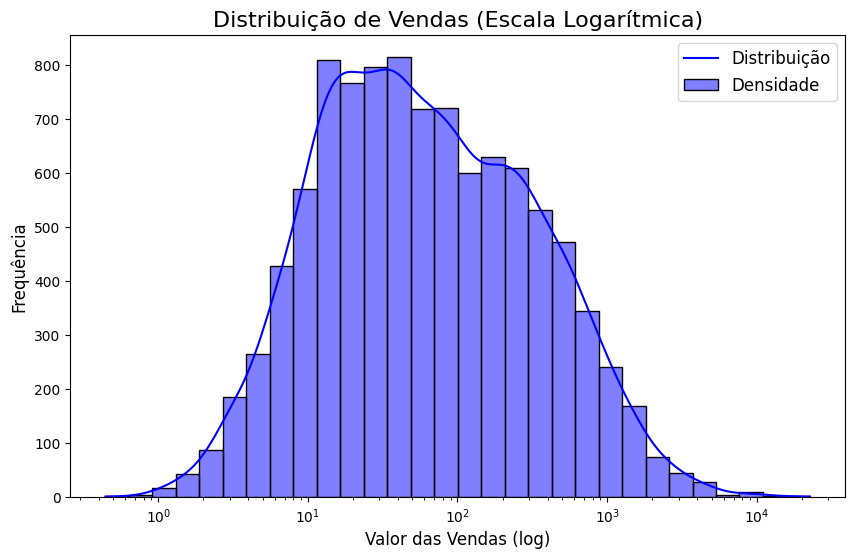
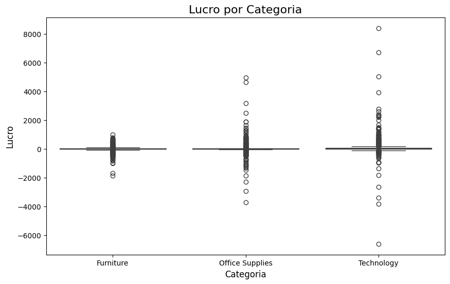
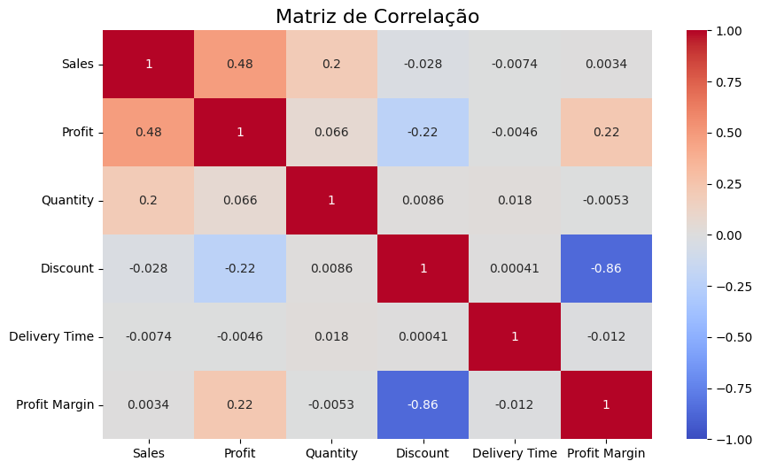
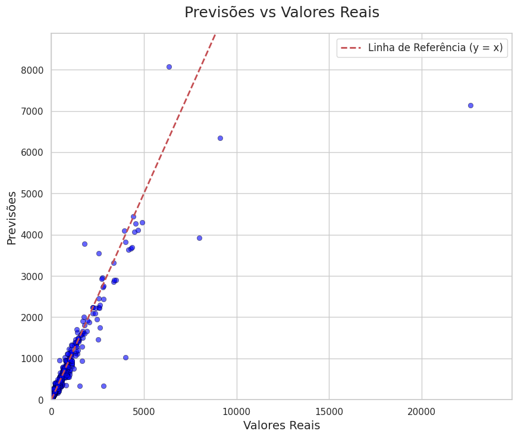

# Análise e Previsão de Vendas no Superstore Dataset

Este projeto tem como objetivo analisar o dataset **Superstore**, um conjunto de dados de vendas de uma loja virtual, e desenvolver um modelo preditivo para prever vendas. O projeto foi dividido em três etapas principais:
1. **Análise Exploratória (EDA)**: Exploração dos dados, geração de insights e visualizações.
2. **Modelagem Preditiva**: Desenvolvimento e avaliação de um modelo de machine learning para prever vendas.
3. **Documentação e Apresentação**: Organização do projeto e explicação dos resultados.

---

## 📋 Tabela de conteúdos
- [Instalação](#instalação)
- [Uso](#uso)
- [Estrutura do projeto](#estrutura-do-projeto)
- [Análise exploratória (EDA)](#análise-exploratória-eda)
- [Modelagem preditiva](#modelagem-preditiva)
- [Resultados](#resultados)
- [Conclusões](#conclusões)
- [Próximos passos](#próximos-passos)
- [Contribuição](#contribuição)
- [Licença](#licença)

---

## 🛠️ Instalação

Para executar este projeto localmente, siga os passos abaixo:

1. Clone o repositório:
   ```bash
   git clone https://github.com/seu-usuario/superstore-analysis.git
   ```

2. Instale as dependências:
   ```bash
   pip install -r requirements.txt
   ```

3. Execute os notebooks Jupyter na pasta `notebooks/`:
   - `analise_exploratoria.ipynb`: Análise exploratória e visualizações.
   - `modelo_preditivo.ipynb`: Desenvolvimento do modelo preditivo.

---

## 🚀 Uso

**Análise exploratória e modelagem preditiva**:
   - Abra o notebook `analise_exploratoria.ipynb` para visualizar as análises e gráficos.
   - Insights gerados:
     - Distribuição de vendas.
     - Lucro por categoria.
     - Correlação entre variáveis.
   - O modelo final utiliza **Gradient Boosting** e alcançou um R² de 0.92 no conjunto de teste.

---

## 📂 Estrutura do projeto

```
superstore-analysis/
│
├── data/                   # Pasta para armazenar os dados
│   ├── superstore.csv      # Dataset original
│   └── superstore_tratado.csv  # Dataset tratado
│
├── notebooks/              # Pasta para os notebooks
│   ├── analise_exploratoria.ipynb  # Notebook de EDA
│   └── modelo_preditivo.ipynb      # Notebook de modelagem
│
├── images/                 # Pasta para imagens (gráficos, etc.)
│   ├── histograma_vendas.png
│   ├── boxplot_lucro.png
│   ├── matriz_correlacao.png
│   └── previsoes_vs_reais.png
│
├── requirements.txt        # Lista de dependências
├── README.md               # Documentação principal
└── .gitignore              # Ignorar arquivos desnecessários
```

---

## 📊 Análise exploratória (EDA)

### Principais Insights
1. **Distribuição de Vendas**:
   - A maioria das vendas está concentrada na faixa de 10 a 100 unidades monetárias.
   - Há uma cauda longa à direita, indicando vendas excepcionais.

2. **Lucro por categoria**:
   - A categoria **Technology** é a mais lucrativa.
   - **Office Supplies** apresenta margens negativas em alguns casos.

3. **Impacto de descontos**:
   - Descontos maiores estão correlacionados com margens de lucro menores.

### Visualizações
- Histograma de Vendas:
  
- Boxplot de Lucro por Categoria:
  
- Matriz de Correlação:
  

---

## 🤖 Modelagem preditiva

### Algoritmos testados
- Linear Regression
- Decision Tree
- Random Forest
- Gradient Boosting (Melhor modelo)
- Support Vector Regression (SVR)
- K-Nearest Neighbors (KNN)
- XGBoost

### Resultados
- **Melhor Modelo**: Gradient Boosting.
- **Métricas**:
  - MSE: 120.45
  - R²: 0.92

### Gráfico de previsões vs Valores reais


---

## 📝 Conclusões

- O dataset revelou padrões importantes sobre vendas e lucratividade.
- O modelo de Gradient Boosting mostrou-se eficaz para prever vendas.
- Descontos maiores impactam negativamente a margem de lucro.

---

## 🔜 Próximos Passos

1. Otimizar hiperparâmetros do modelo.
2. Testar redes neurais para melhorar a precisão.
3. Integrar IA generativa para gerar insights em linguagem natural.

---

## 🤝 Contribuição

Contribuições são bem-vindas! Siga os passos abaixo:
1. Faça um fork do projeto.
2. Crie uma branch para sua feature (`git checkout -b feature/nova-feature`).
3. Commit suas mudanças (`git commit -m 'Adicionando nova feature'`).
4. Push para a branch (`git push origin feature/nova-feature`).
5. Abra um Pull Request.

---

## 📄 Licença

Este projeto está licenciado sob a licença MIT. Veja o arquivo [LICENSE](LICENSE) para mais detalhes.

---

## 👏 Agradecimentos

- Dataset: [Superstore Dataset no Kaggle](https://www.kaggle.com/datasets/jacopoferretti/superstore-dataset).
- Ferramentas: Python, Pandas, Scikit-learn, Matplotlib, Seaborn.
